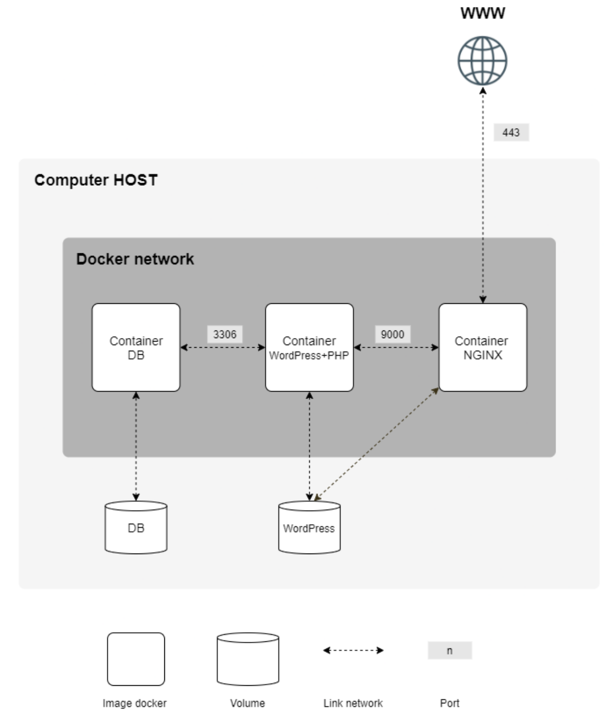
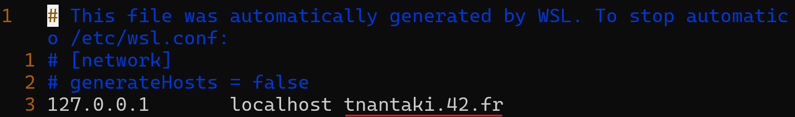
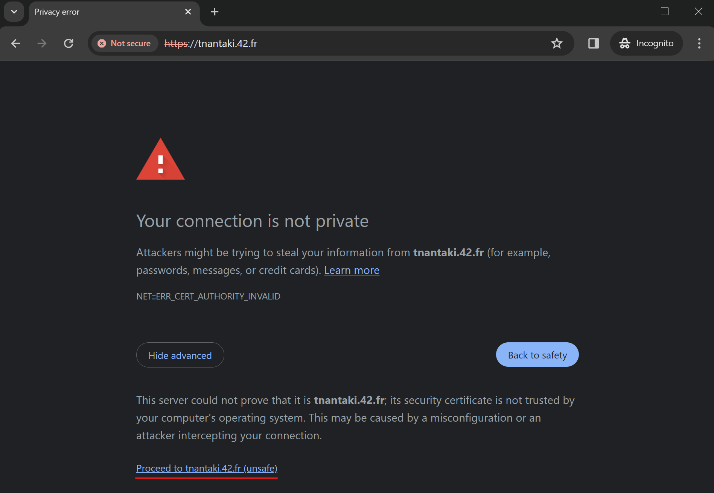
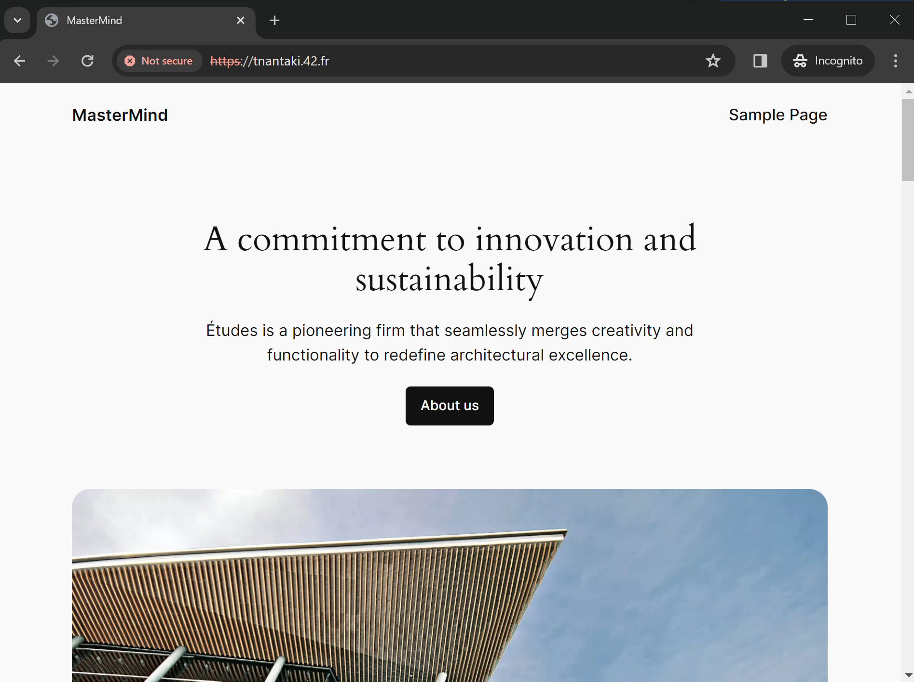

# inception
> This project aim to using Docker to virtualize 3 server. Webserver, PHP-server and Database server to serve Wordpress webpage. I have to write dockerfile base on Debian OS and install individual packages , configuration files on each container. And all of it can be call by Docker-compose.
### Servers Diagram


---
## 📝Usage
### 1. Requirement
1. You must have Docker on your PC.
2. I name domain name as the Intra name. So if you want to run on PC, You have to change loopback IP address to take my domain name too.
**on linux**
```bash
sudo vim /etc/hosts
```

**on windows**
Change on this path with administrator `c:\Windows\System32\Drivers\etc\hosts`


### 2. Execution
To run servers, run `make` on **inception** directory.

```bash
$ make
```

> ⚠️ Warning
>  You need to let me create directory to mount volumes. maybe you have to fill the password of your sudo.
### 3. Usage
1. After run server successful, open any browser in your PC with this URL https://tnantaki.42.fr
 
 
2. Proceed with unsafe
 